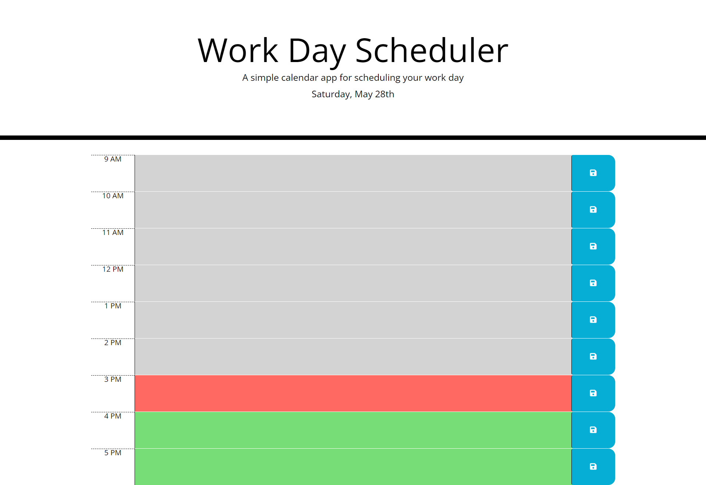

# Day Planner

## Description

- In today's busy era, it is fairly easy to forget about our todo list. So this gave me an idea to create a day planner in which you can write the jobs you want to accomplish. 

- To achieve my goal, I created this application. In it you can write the important jobs which you want to accomplish, but you are affraid that you will forget them.

- It will make the hectic life of today's human a bit easy. Thus giving them a siegh of relief, as they do not have to remember everything which need to be done on that specific day.

-Java script and Jquery were totally new to me, so I learned them and used them in a way which enhances my understanding of them.

## Table of Contents

-installation
-Download and install Git bash
-Open your Git bash application
-Type in command mkdir Mini personal assistant
-By using cd command go into Mini personal assistant
-Enter git clone https://github.com/sachmilan/Mini-Personal-Assistant.git

## Credits
Sachmilan Singh, David Johnson(tutor), Kevin Powel (youtube videos), mlimgonz(looked at her code for guidance).

## Usage

Using this Day planner or one can a mini personal assistant, is really easy. All tou have to type in the text box of the respective hour, whatever job you want to remember, then hit save and then forget about the job, as you can just look at the planner for it.

## Features

It is extreamly user friendly, all you need is a working device and you are all set to use it. Moreover, its color changes, as the time passes, so its more interactive.

## How to contribute

You can always look at the HTML code and the CSS styling  which I use. I trust myself completely; however, not a single man on this earth is perfect, so if you find a better way to code the Day planner, or find any fault in my code, feel free to contact me on Linkedin, Github and Gmail, all you have to do is to search my name- Sachmilan Singh.
